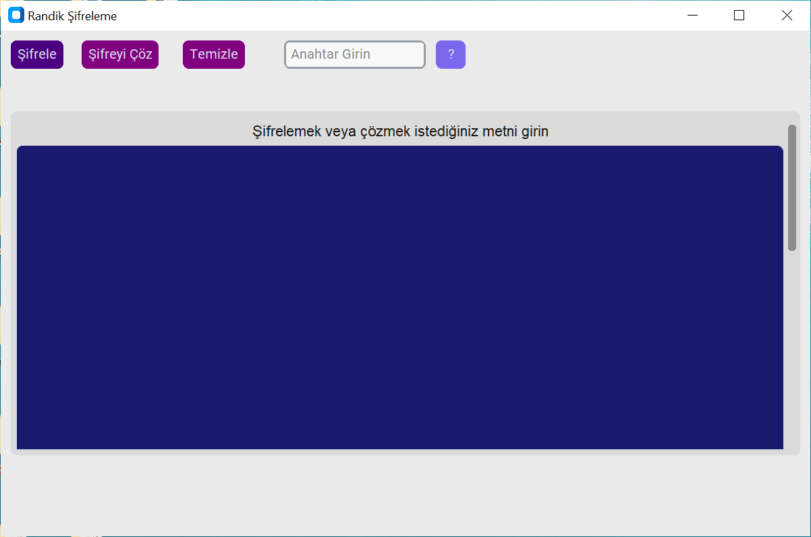

  

# Randik Şifreleme Programı
## Nedir?
Bu bir metin şifreleme programıdır. Randik adını verdiğim bir şifreleme yazılımını kullanır ve Anahtar özelliği sayesinde kırılması çok zor şifreler üretebilir.

  

## indirme
### Python Kodu: <a href="https://github.com/YigitC7/RandikSifreleme/releases/download/12.03.2025/RandikProgramKodlari.zip">İndir</a>
Python kodu, yorumlayıcısı ile çalışabilir. Bu yorumlayıcı olduğu sürece bütün işletim sistemlerinde, mimari fark etmeksizin çalışır.
### Windows exe: <a href="https://github.com/YigitC7/RandikSifreleme/releases/download/12.03.2025/RandikSifreleme.exe">İndir</a>
Exe bin dosyası Windows 10-11 64 Bit için uygundur.

